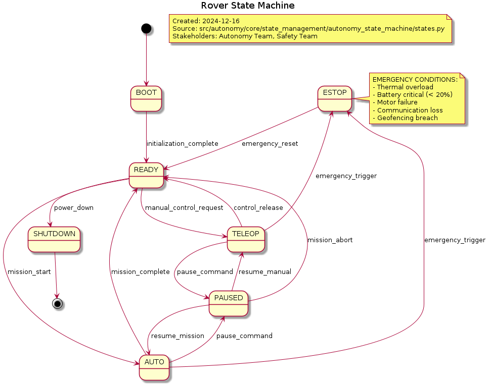

.. _diagrams_overview:

================
Diagrams Overview
================

This page provides a quick reference to all system architecture diagrams. Each diagram shows a different aspect of the URC 2026 Mars Rover system.

.. contents::
   :local:
   :depth: 2

System Architecture Diagrams
=============================

.. list-table:: Key Architecture Diagrams
   :header-rows: 1
   :widths: 30 40 30

   * - Diagram
     - What it shows
     - Use case

   * - **System Component Architecture**
     - How all 6 layers work together
     - **Start here** for big picture understanding

   * - **ROS2 Communication Architecture**
     - How components talk to each other
     - Network and communication issues

   * - **State Machine Architecture**
     - How system states change
     - Mission execution and safety

   * - **Mission Behavior Classes**
     - How missions are structured
     - Adding new mission types

   * - **Hardware Interface Architecture**
     - How software controls hardware
     - ARM, motors, sensors integration

Quick Access to Diagrams
========================

**🔴 Critical Diagrams (Start Here)**
   - :download:`System Component Architecture <architecture/diagrams/high/04_system_component_architecture.png>`
   - :download:`ROS2 Communication Architecture <architecture/diagrams/high/05_ros2_communication_architecture.png>`
   - :download:`State Machine Architecture <architecture/diagrams/critical/01_core_system_state_machine.png>`

**🟡 High-Level Diagrams**
   - :download:`Mission Behavior Classes <architecture/diagrams/high/06_mission_behavior_classes.png>`
   - :download:`Frontend Component Architecture <architecture/diagrams/medium/08_frontend_component_architecture.png>`

**🟢 Detailed Diagrams**
   - :download:`Hardware Interface Architecture <architecture/diagrams/medium/09_hardware_interface_architecture.png>`
   - :download:`Configuration Management <architecture/diagrams/medium/10_configuration_management.png>`
   - :download:`Data Flow Architecture <architecture/diagrams/low/11_data_flow_architecture.png>`

Visual System Overview
======================

.. image:: architecture/diagrams/high/04_system_component_architecture.png
   :alt: System Component Architecture
   :align: center
   :width: 80%

**The 6 Layers:**
1. **🎯 Missions** - What the rover does
2. **🤖 Autonomy** - How the rover thinks
3. **👁️ Perception** - How the rover sees
4. **🎮 Control** - How the rover moves
5. **🌉 Communication** - How parts talk
6. **💻 Interface** - How you control it

Communication Flow
==================

.. image:: architecture/diagrams/high/05_ros2_communication_architecture.png
   :alt: ROS2 Communication Architecture
   :align: center
   :width: 80%

**Data Flow Patterns:**
- **Mission Commands** flow down (Interface → Autonomy → Control)
- **Sensor Data** flows up (Hardware → Perception → Autonomy)
- **Health Status** flows everywhere (all layers monitor each other)

State Management
================



**Key States:**
- **IDLE** - Waiting for mission
- **PLANNING** - Preparing mission execution
- **EXECUTING** - Running mission
- **RECOVERY** - Handling errors
- **EMERGENCY** - Safety stop

Mission Structure
=================

.. image:: architecture/diagrams/high/06_mission_behavior_classes.png
   :alt: Mission Behavior Classes
   :align: center
   :width: 80%

**Mission Types:**
- **Sample Collection** - Pick up science samples
- **Delivery** - Transport objects
- **Waypoint Navigation** - GPS waypoint following
- **Autonomous Keyboard** - Computer interaction
- **Follow Me** - ArUco tag tracking

Using the Diagrams
==================

**For New Team Members:**
1. Start with System Component Architecture
2. Understand Communication Architecture
3. Read your role's specific diagrams

**For Debugging Issues:**
1. Check Communication Architecture for data flow
2. Review State Machine for execution logic
3. Examine Hardware Interface for control issues

**For Adding Features:**
1. Study Mission Behavior Classes for new missions
2. Review Component Architecture for integration points
3. Check Configuration Management for settings

Diagram Maintenance
===================

**When Code Changes:**
- Update affected diagrams
- Regenerate PNG files from PlantUML sources
- Review with stakeholders

**PlantUML Sources:**
Located in ``docs/architecture/diagrams/`` with ``.puml`` extensions.

**Generation:**
```bash
cd docs/architecture/diagrams
java -jar plantuml.jar *.puml
```

Related Documentation
=====================

- :doc:`big_picture` - System overview for beginners
- :doc:`architecture/overview` - Detailed architecture documentation
- :doc:`network_guide` - Network team responsibilities
- :doc:`slam_nav_guide` - Navigation team responsibilities
- :doc:`arm_guide` - ARM team responsibilities
- :doc:`testing_guide` - Testing team responsibilities


