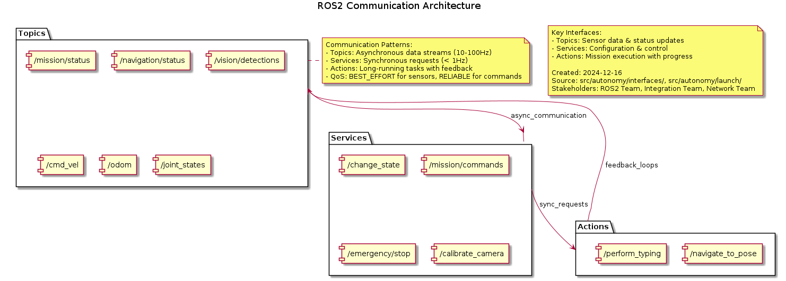

.. _network_guide:

===============
Network Team Guide
===============

Welcome to the Network Team! You own the communication infrastructure that keeps all rover systems talking to each other. Network issues can bring the entire rover to a halt, so your work is critical.



What You Own
============

**Communication Infrastructure:**
- ROS2 topic/service/action messaging
- WebSocket bridges for web dashboard
- Network resilience for 2.4GHz WiFi environments
- DDS domain management
- Emergency communication fallbacks

**Key Files:**
- ``src/core/network_resilience.py`` - Network resilience management
- ``src/bridges/`` - Communication bridges
- ``src/core/unified_communication_api.py`` - Central communication hub
- ``src/core/dds_domain_redundancy_manager.py`` - DDS management

Your Day-to-Day
===============

**Monitoring Network Health:**
```bash
# Check ROS2 network status
ros2 topic echo /network/status

# Monitor topic bandwidth
ros2 topic hz /navigation/odom

# Check for dropped messages
ros2 topic echo /system/health | grep -i network
```

**Common Issues You Fix:**
- Packet loss in 2.4GHz environments
- WebSocket connection drops
- ROS2 node discovery problems
- DDS domain conflicts
- Emergency communication failures

Week 1: Getting Started
=======================

**Day 1: Understand the Architecture**
1. Read the Big Picture guide
2. Study the ROS2 Communication Architecture diagram above
3. Run ``./start.py dev dashboard`` and watch network traffic
4. Execute ``ros2 topic list`` to see all active topics

**Day 2: Learn Network Monitoring**
```bash
# Monitor all network-related topics
ros2 topic echo /network/status
ros2 topic echo /bridge/websocket/status
ros2 topic echo /system/health

# Check network resilience metrics
ros2 service call /network/get_metrics autonomy_interfaces/srv/GetNetworkMetrics
```

**Day 3: Test Network Resilience**
```bash
# Run network chaos tests
python -m pytest tests/integration/test_network_integration.py -v

# Test WebSocket bridge
python -m pytest tests/integration/test_websocket_bridge_integration.py -v
```

**Day 4-5: Your First Network Fix**
1. Identify a network issue (real or simulated)
2. Use the debugging tools below
3. Implement a fix
4. Test your changes

Network Debugging Tools
=======================

**ROS2 Network Diagnostics:**
```bash
# List all topics and their types
ros2 topic list -t

# Monitor topic publication rate
ros2 topic hz /navigation/goal

# Check topic bandwidth usage
ros2 topic bw /camera/image_raw

# Find nodes publishing to a topic
ros2 node list
ros2 node info /navigation_node
```

**Network Resilience Testing:**
```bash
# Test network under stress
python tools/network_stress_test.py

# Monitor packet loss
python tools/network_monitor.py --interface wlan0

# Test reconnection logic
python tools/test_network_reconnect.py
```

**WebSocket Bridge Debugging:**
```bash
# Test WebSocket connection
curl -I http://localhost:8080/health

# Monitor bridge logs
tail -f log/websocket_bridge.log

# Test bridge throughput
python tools/websocket_load_test.py
```

Key Network Components
======================

**1. Network Resilience Manager** (``src/core/network_resilience.py``)
- Handles 2.4GHz WiFi interference
- Implements adaptive reconnection strategies
- Monitors network quality metrics
- Provides fallback communication paths

**2. WebSocket Bridges** (``src/bridges/websocket_bridge.py``)
- Connects web dashboard to ROS2 system
- Handles real-time telemetry streaming
- Manages bidirectional communication
- Implements connection pooling

**3. DDS Domain Manager** (``src/core/dds_domain_redundancy_manager.py``)
- Manages ROS2 DDS domains
- Handles domain participant discovery
- Provides redundancy for critical domains
- Monitors domain health

**4. Emergency Bridge** (``src/bridges/emergency_bridge.py``)
- Fallback communication when primary networks fail
- Minimal protocol for critical commands
- Battery-efficient operation
- Independent of ROS2 infrastructure

Common Network Issues & Solutions
=================================

**High Packet Loss:**
```python
# Check current network metrics
network_status = get_network_metrics()
if network_status.packet_loss > 0.1:  # 10% threshold
    enable_redundancy_mode()
    switch_to_backup_channel()
```

**WebSocket Disconnects:**
```python
# Implement exponential backoff reconnection
async def reconnect_websocket():
    for attempt in range(MAX_RETRIES):
        try:
            await websocket.connect()
            break
        except ConnectionError:
            wait_time = min(BASE_DELAY * (2 ** attempt), MAX_DELAY)
            await asyncio.sleep(wait_time)
```

**ROS2 Discovery Problems:**
```bash
# Check ROS2 environment
echo $ROS_DOMAIN_ID
echo $ROS_LOCALHOST_ONLY

# Restart discovery service
ros2 daemon stop
ros2 daemon start
```

**DDS Domain Conflicts:**
```python
# Ensure unique domain IDs
domains = get_active_domains()
for domain_id in domains:
    if domain_id in RESERVED_DOMAINS:
        log_conflict(domain_id)
        reassign_domain(domain_id)
```

Network Testing Strategy
========================

**Unit Tests:**
```bash
# Test individual network components
pytest tests/unit/test_network_resilience.py
pytest tests/unit/test_websocket_bridge.py
pytest tests/unit/test_dds_manager.py
```

**Integration Tests:**
```bash
# Test full network stack
pytest tests/integration/test_network_integration.py
pytest tests/integration/test_communication_redundancy.py
pytest tests/integration/test_websocket_redundancy_full.py
```

**Performance Tests:**
```bash
# Network load testing
pytest tests/performance/test_network_throughput.py
pytest tests/performance/test_websocket_performance.py
```

**Chaos Engineering:**
```bash
# Simulate network failures
pytest tests/extreme/test_network_chaos_extreme.py
pytest tests/chaos/test_chaos_engineering.py
```

Network Performance Metrics
===========================

**Key Metrics to Monitor:**
- **Latency**: <50ms for control commands, <200ms for telemetry
- **Packet Loss**: <5% under normal conditions
- **Throughput**: >10Mbps for camera streams
- **Reconnection Time**: <5 seconds after network drops
- **WebSocket Connections**: Stable pool of 10-50 connections

**Monitoring Commands:**
```bash
# Real-time network monitoring
watch -n 1 "ros2 topic hz /network/metrics"

# Bandwidth usage
iftop -i wlan0

# Connection tracking
netstat -tuln | grep :8080
```

Network Security Considerations
===============================

**Secure Communication:**
- Encrypt WebSocket connections in production
- Use ROS2 security features for sensitive topics
- Implement authentication for remote access
- Monitor for unauthorized network access

**Emergency Protocols:**
- Maintain emergency communication channels
- Implement "safe mode" network configuration
- Have manual override capabilities
- Document emergency network procedures

Development Workflow
===================

**Making Network Changes:**
1. **Understand the impact**: Network changes affect all systems
2. **Test thoroughly**: Use all test levels (unit → integration → chaos)
3. **Monitor performance**: Ensure no degradation in metrics
4. **Document changes**: Update network architecture diagrams
5. **Coordinate deployment**: Network changes may require system restarts

**Code Review Checklist:**
- [ ] Network metrics are properly monitored
- [ ] Error handling for network failures implemented
- [ ] Performance impact assessed
- [ ] Security implications considered
- [ ] Documentation updated
- [ ] Tests added for new functionality

Getting Help
============

**Network-Specific Resources:**
- ROS2 Network Configuration Guide
- WebSocket Protocol Documentation
- DDS Security Best Practices
- Network Troubleshooting Playbook

**Team Resources:**
- Network architecture diagrams in ``docs/architecture/diagrams/``
- Network test utilities in ``tools/network/``
- Performance monitoring dashboards
- Emergency network procedures

**When You're Stuck:**
1. Check the network logs: ``tail -f log/network_*.log``
2. Run diagnostics: ``python tools/network_diagnostics.py``
3. Test in isolation: ``python tools/test_network_isolation.py``
4. Ask in #network-team channel

Remember: Network issues can be invisible until they cause system failures. Your proactive monitoring and quick fixes keep the entire rover running smoothly!


