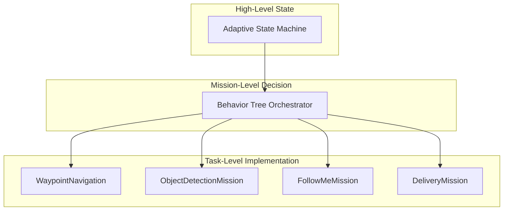
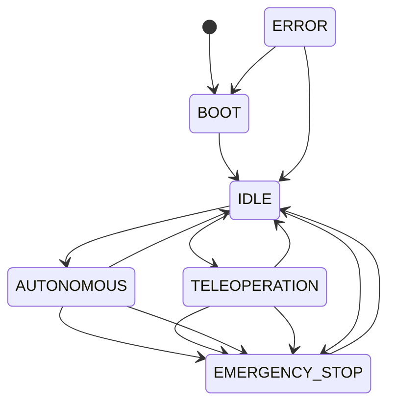

# Pillar 2: Cognition and Decision Making

Detailed presentation and onboarding material for the URC Mars Rover cognition stack: state machines, behavior trees, mission behaviors, and their integration.

---

## 1. Cognitive Architecture Overview

### Component Hierarchy



- **State Machine**: System-level state (BOOT, IDLE, AUTONOMOUS, TELEOPERATION, EMERGENCY_STOP, ERROR).
- **Behavior Tree**: Mission-level logic (which mission, which phase, retries, timeouts).
- **Mission Behaviors**: Concrete implementations (waypoints, object approach, follow-me, delivery).

Design: hierarchical decision making with clear separation between system state, mission logic, and task execution.

---

## 2. State Machine Architecture

### What It Is

The state machine defines the rover’s **mode** (BOOT, IDLE, AUTONOMOUS, TELEOPERATION, EMERGENCY_STOP, ERROR) and, within AUTONOMOUS or TELEOPERATION, **substates** (e.g. waypoint_navigation, sample_collection, manual_control). It is the single source of truth for “what mode are we in?” so the BT, navigation, and UI stay aligned.

### Why It Is Used

- **Safety**: Only allowed transitions are applied; E-stop is valid from any state.
- **Coordination**: The BT checks system state before running missions; the dashboard and missions request mode changes via a topic so one component does not bypass another.
- **Clarity**: Substates (e.g. waypoint_navigation) make it clear what the rover is doing within autonomous or teleop.

### How It Is Used

- **Read state**: BT or other nodes call the `/adaptive_state_machine/get_state` service; dashboard or nodes subscribe to `/adaptive_state_machine/state` for updates.
- **Change state**: Publish a JSON command to `/adaptive_state_machine/commands` (see Section 3 for the exact format and flow).
- **Core elements**: States and substates (enums), valid-transition map (`can_transition_to`), command topic (String, JSON), state service (GetSystemState), state topic (SystemStateMsg). To contribute: add new substates in the enum and, if needed, new allowed transitions in `can_transition_to`; keep command format documented.

### State Hierarchy

**Top-level states** (from [src/core/adaptive_state_machine.py](src/core/adaptive_state_machine.py)):

| State | Description |
|-------|-------------|
| BOOT | System startup |
| IDLE | Ready, no active mode |
| AUTONOMOUS | Autonomous mission active |
| TELEOPERATION | Teleop control active |
| EMERGENCY_STOP | E-stop active |
| ERROR | Error state |

**Autonomous substates**:

| Substate | Description |
|----------|-------------|
| NONE | No active autonomous task |
| WAYPOINT_NAVIGATION | Following waypoints |
| SAMPLE_COLLECTION | Science sample collection |
| DELIVERY | Pickup/delivery |
| FOLLOW_ME | Following operator |
| RETURN_TO_OPERATOR | Returning to operator |

**Teleoperation substates**:

| Substate | Description |
|----------|-------------|
| NONE | No teleop task |
| MANUAL_CONTROL | Direct manual control |
| SEMI_AUTONOMOUS | Semi-autonomous assist |

### Implementation References

- **Unified state management**: [src/core/state_management.py](src/core/state_management.py) — `StateManager`, `HierarchicalStateMachine`, `StateSynchronizationManager`.
- **ROS2 adaptive state machine**: [src/core/adaptive_state_machine.py](src/core/adaptive_state_machine.py) — `AdaptiveStateMachine` (LifecycleNode).

### ROS2 Service Interface

- **Service**: `/adaptive_state_machine/get_state` (GetSystemState).
- **Topic (state publishing)**: `/adaptive_state_machine/state` (SystemStateMsg).
- **Topic (commands)**: `/adaptive_state_machine/commands` (String, JSON).

### State Transition Validation

From `adaptive_state_machine.py`:

```python
def can_transition_to(self, target_state: SystemState) -> bool:
    """Check if transition to target state is allowed."""
    valid_transitions = {
        SystemState.BOOT: [SystemState.IDLE],
        SystemState.IDLE: [SystemState.AUTONOMOUS, SystemState.TELEOPERATION],
        SystemState.AUTONOMOUS: [SystemState.IDLE, SystemState.EMERGENCY_STOP],
        SystemState.TELEOPERATION: [SystemState.IDLE, SystemState.EMERGENCY_STOP],
        SystemState.EMERGENCY_STOP: [SystemState.IDLE],
        SystemState.ERROR: [SystemState.BOOT, SystemState.IDLE]
    }
    if target_state == SystemState.EMERGENCY_STOP:
        return True
    return target_state in valid_transitions.get(self.current_state, [])
```

---

## 3. Core State Machine Implementation

### What It Is

The core state machine has two layers:

- **HierarchicalStateMachine** ([src/core/state_management.py](src/core/state_management.py)): A generic, event-driven state machine with states, transitions, optional entry/exit actions, and (when the `transitions` library is present) a backing state model. Used for complex or reusable state logic.
- **AdaptiveStateMachine** ([src/core/adaptive_state_machine.py](src/core/adaptive_state_machine.py)): A ROS2 LifecycleNode that holds the *actual* system state (BOOT, IDLE, AUTONOMOUS, TELEOPERATION, EMERGENCY_STOP, ERROR). It exposes a service for queries and a topic for commands, validates every transition, and publishes state changes. Operations (dashboard, missions, operator) change state by publishing to the commands topic.

### Why It Is Used

- **Single source of truth**: One place that defines “are we in autonomous or teleop?” so the BT, navigation, and UI stay aligned.
- **Safe transitions**: Only allowed transitions are applied; E-stop is allowed from any state.
- **BT and mission coordination**: The BT calls `GetSystemState` before running missions; missions or the dashboard request mode changes via the commands topic.

### How State Changes Are Triggered from Operations

There is no separate “event name” string like in the Python HierarchicalStateMachine. In operations, **the trigger is publishing a JSON command to the ROS2 topic `/adaptive_state_machine/commands`**.

**Flow:**

1. **Trigger**: Any node (e.g. dashboard, mission script, operator tool) publishes a `std_msgs/String` to `/adaptive_state_machine/commands` with JSON in `msg.data`.
2. **Callback**: `AdaptiveStateMachine.state_command_callback(msg)` runs.
3. **Parse**: `command = json.loads(msg.data)`. Supported `action` values: `"transition"`, `"set_substate"`.
4. **Transition**: For `action == "transition"`, the code reads `target_state` and calls `handle_state_transition(target_state, metadata)`.
5. **Validation**: `handle_state_transition` converts the string to `SystemState`, then calls `can_transition_to(target_state)`. If invalid, a warning is logged and no change happens.
6. **Apply**: If valid, `transition_to(new_state, metadata)` runs: update `current_state`, reset substates when entering IDLE or EMERGENCY_STOP, update `state_metadata`, then publish the new state on `/adaptive_state_machine/state`.

**Example: operator switches to autonomous**

```python
# Publisher (e.g. dashboard or mission node)
from std_msgs.msg import String
import json

cmd = String()
cmd.data = json.dumps({
    "action": "transition",
    "target_state": "autonomous",
    "metadata": {"source": "dashboard", "reason": "start_mission"}
})
state_commands_pub.publish(cmd)
```

The state machine receives this, validates that the current state (e.g. IDLE) allows a transition to `autonomous`, then calls `transition_to(SystemState.AUTONOMOUS, metadata)` and publishes the new state.

**Example: set autonomous substate (e.g. waypoint_navigation)**

```python
cmd.data = json.dumps({
    "action": "set_substate",
    "substate_type": "autonomous",
    "substate": "waypoint_navigation"
})
state_commands_pub.publish(cmd)
```

Substates are updated in place; no transition check is used for substate-only updates.

### Key Operations (HierarchicalStateMachine)

**Adding states and transitions** (used when building a state model in Python, e.g. for tests or non-ROS logic):

```python
# From state_management.py - HierarchicalStateMachine
def add_state(self, name: str, description: str = "",
              entry_actions: Optional[List[Callable]] = None,
              exit_actions: Optional[List[Callable]] = None,
              parent: Optional[str] = None) -> StateDefinition:
    state_def = StateDefinition(
        name=name,
        type=StateType.HIERARCHICAL_STATE_MACHINE,
        description=description,
        entry_actions=entry_actions or [],
        exit_actions=exit_actions or [],
        parent=parent
    )
    self.states[name] = state_def
    if parent and parent in self.states:
        self.states[parent].children.append(name)
    # ... add to transitions machine
    return state_def

def add_transition(self, event: str, source: str, target: str,
                   conditions: Optional[List[Callable]] = None,
                   before: Optional[List[Callable]] = None,
                   after: Optional[List[Callable]] = None):
    if source in self.states:
        self.states[source].transitions[event] = target
    # ... register with transitions library, event handlers
```

**Triggering events** (for the Python state machine; not used by AdaptiveStateMachine, which uses the topic flow above):

```python
def trigger_event(self, event: str, **kwargs) -> bool:
    if self.machine:
        try:
            getattr(self.machine, event)(**kwargs)
            success = True
        except Exception as e:
            logger.error(f"State transition failed: {e}")
            success = False
    else:
        success = self._manual_transition(event, **kwargs)
    if success:
        # Record transition, call event handlers
        ...
    return success
```

Here `event` is a string that must match a transition name (e.g. `"to_autonomous"`). The transitions library or `_manual_transition` looks up `source -> event -> target` and switches state.

### LifecycleNode Integration: How It Works and Why It Is Needed

**What it is:** `AdaptiveStateMachine` is a ROS2 **LifecycleNode**, so it goes through configured states: Unconfigured -> Inactive -> Active -> Finalized, with callbacks `on_configure`, `on_activate`, `on_deactivate`, `on_cleanup`, `on_shutdown`.

**Why it is needed:**

- **Startup order**: The BT orchestrator and dashboard need `/adaptive_state_machine/get_state` to exist before they run. With a LifecycleNode, the manager starts the node in Unconfigured, then calls Configure. Only after Configure do services and subscriptions exist. Then Activate is called. So no other node can call `get_state` before the service is advertised.
- **Clean shutdown**: Deactivate stops “normal operation” (e.g. no new transition requests processed in the same way), then Cleanup destroys services and subscriptions. That avoids callbacks running after resources are torn down.
- **Deterministic behavior**: The system can assume “state machine is active” only after Activate, so integration tests and launch files can rely on a clear ready state.

**How it works:**

| Phase | Callback | What happens |
|-------|----------|----------------|
| Configure | `on_configure()` | Create service `/adaptive_state_machine/get_state`, subscription to `/adaptive_state_machine/commands`, optional clients (e.g. system health, navigation). No state change yet. |
| Activate | `on_activate()` | Transition to IDLE via `transition_to(SystemState.IDLE)`. State machine is now “running”; BT and others can call `get_state` and publish commands. |
| Deactivate | `on_deactivate()` | Node is taken out of active operation; timers/callbacks can be stopped. |
| Cleanup | `on_cleanup()` | Destroy service and subscriptions so no further commands or queries are served. |
| Shutdown | `on_shutdown()` | Last-resort cleanup if the node is killed. |

So: **construct** the state machine in `__init__`, **expose** it only after `on_configure` (services/subscriptions), **start** normal operation in `on_activate` (transition to IDLE), and **tear down** in deactivate/cleanup. Contributing a new way to change state (e.g. a service) would mean adding it in `on_configure` and cleaning it in `on_cleanup`.

### State Diagram



---

## 4. Behavior Tree Architecture

### What It Is

- **Behavior tree (BT)**: A tree of nodes (actions, conditions, composites, decorators) that are ticked from the root each cycle. Each node returns SUCCESS, FAILURE, or RUNNING. Composites and decorators decide which child runs next; actions and conditions do the real work or checks.
- **BT orchestrator**: A ROS2 node (C++: [src/autonomy/bt/src/bt_orchestrator.cpp](src/autonomy/bt/src/bt_orchestrator.cpp)) that owns the tree, a shared blackboard, and ROS2 I/O. It loads the tree from an XML file, registers custom node types, subscribes to odom/SLAM (and others) to fill the blackboard, and runs a timer that calls `tree_->tickRoot()` at a fixed rate (e.g. 10 Hz). It also provides action servers (e.g. navigate_to_pose, execute_mission) so external clients can trigger or guide missions.
- **Python BT** ([missions/robust_behavior_tree.py](missions/robust_behavior_tree.py)): Py-trees based implementation with composites, decorators, circuit breaker, and monitoring; used for mission logic that stays in Python or for prototyping.

### Why It Is Used

- **Modular mission logic**: Missions are expressed as trees (sequences, fallbacks, retries) instead of one big state machine or script.
- **Reactive**: Each tick, the tree sees the latest blackboard (and thus sensors/state); conditions can fail and selectors can switch strategies without extra glue code.
- **Reusable nodes**: NavigateToWaypoint, DetectArUcoPost, SampleCollection, etc., are registered once and composed in different trees.

### How the Orchestrator Works (Granular Level)

1. **Lifecycle (C++ Jazzy BT orchestrator)**  
   - **on_configure**: Create blackboard and set default keys; register node types with `BT::BehaviorTreeFactory`; load the tree from XML (`createTreeFromFile(bt_file_path, blackboard_)`); create subscribers (e.g. `/odom`, `/slam/pose`), publishers (`/bt/telemetry`), and action servers (e.g. `/jazzy_bt/navigate_to_pose`). No ticking yet.  
   - **on_activate**: Start a wall timer (e.g. 100 ms = 10 Hz) that calls `execute_tree_callback`; start a telemetry timer; activate lifecycle publishers and action servers. The tree is now ticked every period.  
   - **on_deactivate**: Cancel timers, deactivate publishers and action servers. Ticking stops.  
   - **on_cleanup**: Release timers and other resources.  
   - **on_shutdown**: Call `tree_->haltTree()` for emergency stop.

2. **Tick loop**  
   - Each timer fire runs `execute_tree_callback()`.  
   - It calls `BT::NodeStatus status = tree_->tickRoot()`.  
   - `tickRoot()` (BT.CPP): Starting from the root, the runtime walks the tree according to the current node’s result. For a Sequence, children run in order until one returns FAILURE (then the sequence fails) or all return SUCCESS. For a Selector, children run until one returns SUCCESS (then the selector succeeds) or all return FAILURE. A node that returns RUNNING is revisited on the next tick; the tree “remembers” where it left off. So one call to `tickRoot()` may run one or several nodes depending on the tree and previous RUNNING state.  
   - The returned status (SUCCESS/FAILURE/RUNNING) can be logged or used for telemetry; execution time is recorded and checked against a deadline (e.g. 100 ms).

3. **Blackboard updates**  
   - **Odometry**: `odom_callback` receives `/odom`; writes `robot_x`, `robot_y`, `robot_yaw` (from pose + quaternion-to-RPY) into the blackboard.  
   - **SLAM**: `slam_pose_callback` receives `/slam/pose`; writes `slam_x`, `slam_y`, `slam_confidence`.  
   - These run asynchronously; on the next tick, action and condition nodes read the latest values from the blackboard. Action nodes (e.g. NavigateToWaypoint) may also *write* keys (e.g. `nav_target_x`, `navigation_ok`, `last_error`).

4. **Interfaces**  
   - **State machine**: Condition nodes (e.g. SensorCheck) call the `/adaptive_state_machine/get_state` service to ensure the system is in AUTONOMOUS (or another allowed state) before running; that is the main “interface” between BT and the state machine.  
   - **Action servers**: A client sends a goal (e.g. NavigateToPose); the server accepts it and may set blackboard targets and run or resume the tree until the goal succeeds/fails/cancels, then return result/feedback.

**Core elements to construct / interface / contribute:**

- **Construct**: Define the tree in XML (node types and structure); register every node type with the factory; load the tree with a shared blackboard; run the tick loop from a timer.  
- **Interface**: Publish/subscribe or call services that read/write the same blackboard keys the tree uses; or use the orchestrator’s action servers to drive missions.  
- **Contribute**: Implement a new BT node (inherit from BT.CPP node type or use existing ones), register it in `register_bt_nodes()`, and add it to the XML tree; optionally extend the blackboard keys and the ROS2 callbacks that fill them.

### Node Type Hierarchy

| Type | Role | Examples |
|------|------|----------|
| Action | Do something (nav, detect, type, sample, etc.) | NavigateToWaypoint, DetectArUcoPost, PerformTyping |
| Condition | Check a predicate | SensorCheck, AtWaypoint, BatteryOK |
| Composite | Control flow over children | Sequence, Selector, Parallel |
| Decorator | Modify child behavior | Retry, Timeout, Inverter |

### Blackboard (C++ Orchestrator)

From [src/autonomy/bt/src/bt_orchestrator.cpp](src/autonomy/bt/src/bt_orchestrator.cpp):

```cpp
void initialize_blackboard() {
    blackboard_->set<bool>("mission_active", false);
    blackboard_->set<double>("robot_x", 0.0);
    blackboard_->set<double>("robot_y", 0.0);
    blackboard_->set<double>("robot_yaw", 0.0);
    blackboard_->set<double>("slam_x", 0.0);
    blackboard_->set<double>("slam_y", 0.0);
    blackboard_->set<double>("slam_confidence", 0.0);
    blackboard_->set<int>("samples_collected", 0);
    blackboard_->set<int>("waypoints_completed", 0);
    blackboard_->set<bool>("sensors_ok", true);
    blackboard_->set<bool>("navigation_ok", true);
    blackboard_->set<std::string>("last_error", "");
    blackboard_->set<std::string>("current_mission_phase", "idle");
}
```

**Blackboard key groups**:

- **Robot state**: `robot_x`, `robot_y`, `robot_yaw`, velocity.
- **SLAM**: `slam_x`, `slam_y`, `slam_confidence`.
- **Navigation**: `nav_target_x`, `nav_target_y`, `navigation_ok`.
- **Mission**: `mission_active`, `samples_collected`, `waypoints_completed`, `current_mission_phase`.
- **Safety/health**: `sensors_ok`, `last_error`.

### Blackboard Updates from ROS2

- Odometry (`/odom`) → `robot_x`, `robot_y`, `robot_yaw`.
- SLAM pose → `slam_x`, `slam_y`, `slam_confidence`.
- Navigation and mission nodes read/write blackboard via services or shared blackboard client.

---

## 5. Behavior Tree Node Types

### What They Are

BT nodes are the building blocks of the tree: **actions** (do something), **conditions** (check something), **composites** (sequence, selector, parallel), and **decorators** (retry, timeout, inverter). The C++ orchestrator registers custom node types and loads an XML tree that references them; the Python BT uses py-trees equivalents.

### Why They Are Used

- **Actions**: Encode one unit of work (navigate, detect, type, sample) so missions are composed from reusable pieces.
- **Conditions**: Gate execution (e.g. “only run if system is AUTONOMOUS and sensors are OK”) so the tree reacts to state and sensors.
- **Composites**: Define control flow (order, fallback, parallelism) without hard-coding logic in each action.
- **Decorators**: Add retries, timeouts, or logic inversion without changing the child node.

### How They Are Used

- **Construct**: In C++, implement a class that inherits from the BT.CPP node type (e.g. `BT::StatefulActionNode`), override `tick()`, read/write the blackboard and call ROS2 services/actions as needed; register with `factory_.registerNodeType<MyNode>("MyNode")`; reference in XML (e.g. `<MyNode name="my_node"/>`). In Python, use or extend `BTNode`/`EnhancedBTNode` and composites/decorators from [missions/robust_behavior_tree.py](missions/robust_behavior_tree.py).
- **Interface**: Actions and conditions read blackboard keys (robot pose, SLAM, mission_active, etc.) and optionally call services (e.g. GetSystemState); actions may set keys (navigation_ok, last_error) or drive ROS2 actions.
- **Contribute**: Add a new action or condition node, register it, and wire it into the XML tree (or Python tree); document required blackboard keys and any ROS2 interfaces.

### Action Nodes (C++ BT)

| Node | Purpose |
|------|---------|
| NavigateToWaypoint | Local coordinate navigation |
| NavigateToGNSS | GPS coordinate navigation |
| DetectArUcoPost | AR tag detection for posts |
| DetectObject | Object detection (mallet, hammer, bottle) |
| PerformTyping | Autonomous keyboard typing |
| SampleCollection | Science sample collection |
| PickupObject / DeliverObject | Manipulation |
| InsertCache, ConnectUSB, ConnectHose, TurnValve | Equipment servicing |
| SignalArrival | LED signaling |
| ReadSign, SearchArea | Mission utilities |
| EmergencyStop | Safety shutdown |

### Condition Nodes

- **SensorCheck**: Validates sensor health (IMU, GPS, camera, system_state); often implemented by calling `/adaptive_state_machine/get_state` and checking sensors.
- **Battery level**: Check blackboard or battery topic.
- **Obstacle / path clearance**: From perception or costmap.

### Composite Nodes (Python)

From [missions/robust_behavior_tree.py](missions/robust_behavior_tree.py):

- **BTSequence**: Execute children in order until one fails.
- **BTSelector**: Execute children until one succeeds (fallback).
- **BTParallel**: Execute children concurrently (when used).

```python
class BTSequence(BTCompositeNode):
    """Sequence composite - executes children in order until one fails."""
    def execute(self, context: BTExecutionContext) -> BTNodeResult:
        # Execute children in sequence; on first failure return FAILURE
        ...

class BTSelector(BTCompositeNode):
    """Selector composite - executes children until one succeeds."""
    def execute(self, context: BTExecutionContext) -> BTNodeResult:
        # Execute children until one succeeds; on all failure return FAILURE
        ...
```

### Decorator Nodes (Python)

- **BTRetryDecorator**: Retry child on failure (e.g. max_retries=3).
- **BTTimeoutDecorator**: Enforce timeout on child.
- **BTInverterDecorator**: Invert success/failure.

```python
class BTRetryDecorator(BTDecorator):
    """Retry decorator - retries child execution on failure."""
    def __init__(self, node_id: str, child: BTNode, max_retries: int = 3):
        super().__init__(node_id, child)
        self.max_retries = max_retries

class BTTimeoutDecorator(BTDecorator):
    """Timeout decorator - adds timeout to child execution."""
    def __init__(self, node_id: str, child: BTNode, timeout: float):
        super().__init__(node_id, child)
        self.timeout = timeout

class BTInverterDecorator(BTDecorator):
    """Inverter decorator - inverts child result."""
    def execute(self, context: BTExecutionContext) -> BTNodeResult:
        result = self.child.execute_with_monitoring(context)
        # SUCCESS -> FAILURE, FAILURE -> SUCCESS
        ...
```

### Enhanced Node (Circuit Breaker and Monitoring)

From `robust_behavior_tree.py`:

```python
class EnhancedBTNode(py_trees.behaviour.Behaviour if PY_TREES_AVAILABLE else object):
    """Enhanced behavior tree node with circuit breaker and monitoring."""
    def __init__(self, name: str, node_type: BTNodeType = BTNodeType.ACTION):
        ...
        self.circuit_breaker = circuitbreaker.CircuitBreaker(
            failure_threshold=5,
            recovery_timeout=30.0
        )
    def execute_with_monitoring(self, context: Dict[str, Any]) -> BTNodeStatus:
        # Check circuit breaker, execute, record metrics
        ...
```

---

## 6. Mission-Specific Behaviors

### Mission Implementations

| Mission | Class | File | Purpose |
|---------|-------|------|---------|
| Waypoint navigation | WaypointNavigation | [missions/mission_behaviors.py](missions/mission_behaviors.py) | GPS waypoint following |
| Object detection | ObjectDetectionMission | mission_behaviors.py | Vision-based detect and approach |
| Follow-me | FollowMeMission | mission_behaviors.py | ArUco tag tracking |
| Delivery | DeliveryMission | mission_behaviors.py | Pickup and delivery |

Additional mission modules: [missions/waypoint_navigation_mission.py](missions/waypoint_navigation_mission.py), [missions/sample_collection_mission.py](missions/sample_collection_mission.py), [missions/object_detection_mission.py](missions/object_detection_mission.py), [missions/delivery_mission.py](missions/delivery_mission.py), [missions/follow_me_mission.py](missions/follow_me_mission.py), [missions/return_to_operator_mission.py](missions/return_to_operator_mission.py), [missions/autonomous_keyboard_mission.py](missions/autonomous_keyboard_mission.py).

### WaypointNavigation Example

From `mission_behaviors.py`:

```python
class WaypointNavigation:
    """Waypoint navigation behavior - Navigate between GPS waypoints."""
    def __init__(self, node):
        self.node = node
        self.waypoint_tolerance = 1.0  # meters
        self.heading_tolerance = 5.0   # degrees
        self.timeout = 300.0          # 5 minutes per waypoint

    def execute(self, waypoints: List[Dict[str, float]], sensors) -> Dict[str, Any]:
        completed_waypoints = []
        for i, waypoint in enumerate(waypoints):
            while not self._should_abort() and (time.time() - start_time) < self.timeout:
                current_pos = sensors.get_current_position()
                distance = self._calculate_distance(current_pos, waypoint)
                heading_error = self._calculate_heading_error(current_pos, waypoint)
                if distance < self.waypoint_tolerance and abs(heading_error) < self.heading_tolerance:
                    completed_waypoints.append(waypoint)
                    break
                vx, vtheta = self._compute_velocity_commands(distance, heading_error)
                sensors.send_velocity_command(vx, vtheta)
                time.sleep(0.1)
        return {"completed_waypoints": completed_waypoints, ...}
```

### Autonomous Navigation, Sample Collection, Equipment Servicing, Delivery

- **Autonomous navigation**: GNSS waypoints; AR tag posts for alignment (e.g. keyboard).
- **Sample collection**: Science payload operations; BT action `SampleCollection`.
- **Equipment servicing**: Autonomous typing (`PerformTyping`), cache insertion (`InsertCache`), USB/hose/valve nodes.
- **Delivery**: Pickup and delivery behaviors in `DeliveryMission` and BT actions `PickupObject`, `DeliverObject`.

---

## 7. State Machine and Behavior Tree Integration

### Integration Overview

```mermaid
sequenceDiagram
    participant Mission as Mission Request
    participant BT as BT Orchestrator
    participant SM as Adaptive State Machine
    participant Blackboard as Unified Blackboard
    Mission --> BT
    BT --> SM
    Note over BT,SM: GetSystemState service
    SM --> BT
    BT --> Blackboard
    Blackboard --> BT
    BT --> Mission
```

### Service-Based Communication

- **BT queries state**: BT nodes (e.g. SensorCheck) call `/adaptive_state_machine/get_state` to ensure system is in AUTONOMOUS (or allowed state) before running missions.
- **State machine validates**: Only certain states allow autonomous execution; E-stop can be requested from any state.

Example pattern (conceptual, as in C++ BT):

```cpp
// SensorCheck / state validation in BT
auto client = node_->create_client<GetSystemState>("/adaptive_state_machine/get_state");
// Wait for response; if current_state != AUTONOMOUS, return FAILURE
```

### Topic-Based State Publishing

- **State machine** publishes to `/adaptive_state_machine/state` (SystemStateMsg) on every transition and when queried.
- **BT** (or other nodes) can subscribe to monitor state changes without blocking.

### Unified Blackboard

- **BT orchestrator** updates blackboard from `/odom`, `/slam/pose`, and mission actions.
- **State machine** does not own the blackboard; BT and mission nodes read/write shared keys.
- **UnifiedBlackboardClient** (Python) allows other nodes to get/set blackboard values; C++ uses in-process blackboard.
- **Thread safety**: BT runs in its own executor; blackboard access is synchronized by the BT node that owns it; ROS2 services/topics are thread-safe for single-threaded callbacks.

### QoS for Real-Time Guarantees

- State and mission-critical topics use RELIABLE, TRANSIENT_LOCAL where appropriate so late joiners get latest state.
- BT action servers and state service use default or configured QoS for responsiveness.

---

## 8. Testing and Validation

### Behavior Tree Runtime Tests

[scripts/test_bt_runtime.sh](scripts/test_bt_runtime.sh):

- Sources ROS2 (Jazzy or Humble) and workspace.
- Verifies `bt_orchestrator` executable exists.
- Starts BT orchestrator node and checks it runs.
- Can be extended for service checks and simple mission triggers.

```bash
# From test_bt_runtime.sh
ros2 run autonomy_bt bt_orchestrator &
# ... wait, check process, test service availability
```

### State Machine Transition Validation

- `can_transition_to()` in `AdaptiveStateMachine` encodes allowed transitions; unit tests can call it for each (current, target) pair.
- Integration tests: send state commands via `/adaptive_state_machine/commands` and assert state via `/adaptive_state_machine/get_state` or `/adaptive_state_machine/state`.

### Mission Execution Testing

- Run mission scripts (e.g. waypoint_navigation_mission, delivery_mission) with mocked or simulated sensors.
- Use BT action servers (`/bt/navigate_to_pose`, `/bt/execute_mission`) in integration tests to drive missions and check blackboard or topic outcomes.

### Integration with Simulation

- Start adaptive state machine, BT orchestrator, and mission nodes in simulation; switch to AUTONOMOUS and trigger missions; verify state transitions and mission progress.
- Full system tests: [scripts/test_full_system_integration.sh](scripts/test_full_system_integration.sh), [scripts/test_full_system_with_simulator.sh](scripts/test_full_system_with_simulator.sh).
