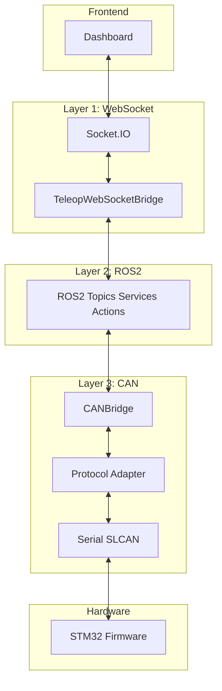
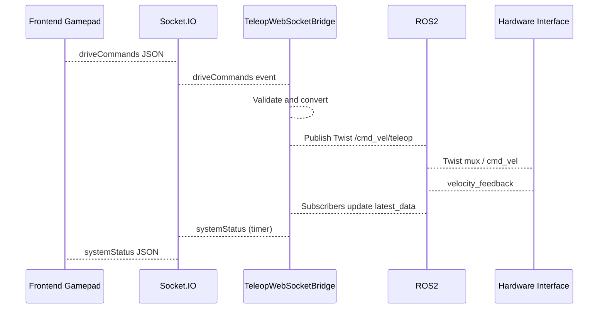
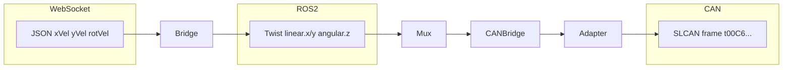

# Pillar 4: Communication Systems

Detailed presentation and onboarding material for the URC Mars Rover communication stack: ROS2, WebSocket bridge, CAN bridge, protocol translation, QoS, and reliability.

---

## 1. Communication Architecture Overview

### Multi-Layer Communication



**Communication layers:**

1. **Frontend to ROS2**: Socket.IO (JSON) to [TeleopWebSocketBridge](src/bridges/teleop_websocket_bridge.py) to ROS2 topics.
2. **ROS2 to hardware**: ROS2 to [CANBridge](src/bridges/can_bridge.py) to Protocol Adapter (SLCAN) to serial/CAN to STM32.
3. **Mission control**: ROS2 to Mission Bridge (WebSocket) to mission control clients.

**Key components:**

- **ROS2**: Humble/Jazzy with Cyclone DDS; Domain ID 42 for URC.
- **WebSocket bridges**: Socket.IO for teleop and mission.
- **CAN bridge**: SLCAN over serial; protocol adapter for encoding/decoding.
- **Protocol adapters**: [ProtocolAdapter](src/bridges/protocol_adapter.py) (ABC), [TeleopCANAdapter](src/bridges/teleop_can_adapter.py).

---

## 2. ROS2 Architecture Introduction

### Package Structure

| Package | Role |
|---------|------|
| autonomy_interfaces | 19 messages, 24 services, 3 actions |
| autonomy_bt | Behavior tree orchestration |
| autonomy_navigation | Navigation stack |
| autonomy_slam | SLAM and depth processing |
| autonomy_computer_vision | Vision processing |
| autonomy_sensor_bridge | Sensor WebSocket bridge |

### Communication Paradigms

| Paradigm | Use Case | Example |
|----------|----------|---------|
| **Topics** | Publisher-subscriber (one-to-many) | `/cmd_vel/teleop`, `/hardware/imu` |
| **Services** | Request-response (one-to-one) | `/adaptive_state_machine/get_state` |
| **Actions** | Long-running with feedback | `/navigate_to_pose`, `/bt/execute_mission` |

### QoS Overview

- **Sensor data**: BEST_EFFORT, VOLATILE (high rate, low latency).
- **Commands**: RELIABLE, TRANSIENT_LOCAL (guaranteed delivery).
- **State**: RELIABLE, TRANSIENT_LOCAL (latest state for late joiners).

### Domain Isolation

- Domain ID 42 used for URC systems to isolate from other ROS2 networks.

---

## 3. ROS2 Topics and Messages

### Command Topics (Input)

| Topic | Message Type | QoS | Purpose |
|-------|--------------|-----|---------|
| `/cmd_vel/teleop` | `geometry_msgs/Twist` | RELIABLE, depth 10 | Teleop commands |
| `/cmd_vel/autonomy` | `geometry_msgs/Twist` | RELIABLE, depth 10 | Autonomous nav |
| `/cmd_vel/safety` | `geometry_msgs/Twist` | RELIABLE | Safety overrides |
| `/cmd_vel/emergency` | `geometry_msgs/Twist` | RELIABLE | Emergency stop |
| `/emergency_stop` | `std_msgs/Bool` | RELIABLE | Global E-stop |
| `/hardware/homing_request` | `std_msgs/Bool` | RELIABLE | Homing |
| `/mission/commands` | `std_msgs/String` | RELIABLE | Mission control |

### Sensor and Feedback Topics (Output)

| Topic | Message Type | Typical Rate | Purpose |
|-------|--------------|--------------|---------|
| `/hardware/chassis_velocity` | `geometry_msgs/TwistStamped` | 50 Hz | From CAN |
| `/hardware/velocity_feedback` | `geometry_msgs/TwistStamped` | 50 Hz | Velocity feedback |
| `/hardware/imu` | `sensor_msgs/Imu` | 100 Hz | IMU |
| `/hardware/battery` | `sensor_msgs/BatteryState` | 10 Hz | Battery |
| `/hardware/gps` | `sensor_msgs/NavSatFix` | 10 Hz | GPS |
| `/odom` | `nav_msgs/Odometry` | 50 Hz | Odometry |
| `/mission/status` | `std_msgs/String` | On change | Mission status |
| `/state_machine/current_state` | `autonomy_interfaces/SystemState` | On change | State machine |
| `/diagnostics` | `diagnostic_msgs/DiagnosticArray` | Periodic | Diagnostics |
| `/vision/detections` | `autonomy_interfaces/VisionDetection` | 10 Hz | Vision |
| `/slam/pose` | `geometry_msgs/PoseStamped` | SLAM rate | SLAM pose |
| `/navigation/status` | `autonomy_interfaces/NavigationStatus` | On change | Navigation |

### Message Types

- **geometry_msgs/Twist**: `linear.x/y/z`, `angular.x/y/z` (m/s, rad/s).
- **sensor_msgs/Imu**: Orientation, angular velocity, linear acceleration, covariances.
- **sensor_msgs/BatteryState**: Voltage, current, percentage, temperature.
- **nav_msgs/Odometry**: Pose, twist, frame IDs.
- **Custom**: VisionDetection, NavigationStatus, SystemState (autonomy_interfaces).

### Priority-Based Command Arbitration

- Twist mux or similar: emergency > safety > teleop > autonomy so higher-priority sources override lower.

```mermaid
flowchart LR
    Teleop[/cmd_vel/teleop]
    Auto[/cmd_vel/autonomy]
    Safety[/cmd_vel/safety]
    Emerg[/cmd_vel/emergency]
    Mux[Twist Mux]
    Cmd[/cmd_vel]
    Teleop --> Mux
    Auto --> Mux
    Safety --> Mux
    Emerg --> Mux
    Mux --> Cmd
```

---

## 4. ROS2 Services and Actions

### Service Definitions (Examples)

| Service | Type | Purpose |
|---------|------|---------|
| `/change_state` | autonomy_interfaces/ChangeState | State machine transitions |
| `/mission/commands` | autonomy_interfaces/ConfigureMission | Mission configuration |
| `/emergency/stop` | autonomy_interfaces/SoftwareEstop | Software E-stop |
| `/calibrate_camera` | autonomy_interfaces/CalibrateCamera | Camera calibration |
| `/get_system_state` | autonomy_interfaces/GetSystemState | State queries (BT) |
| `/get_safety_status` | autonomy_interfaces/GetSafetyStatus | Safety status |
| `/adaptive_state_machine/get_state` | GetSystemState | Adaptive state machine state |

### Action Definitions

| Action | Type | Purpose |
|--------|------|---------|
| `/navigate_to_pose` | autonomy_interfaces/NavigateToPose | Navigation with feedback |
| `/perform_typing` | autonomy_interfaces/PerformTyping | Typing task |
| `/bt/execute_mission` | autonomy_interfaces/ExecuteMission | BT mission execution |

### Service Call Example (BT to State Machine)

BT orchestrator (C++ or Python) calls `/adaptive_state_machine/get_state` to validate system is in AUTONOMOUS before running missions; response includes `current_state`, `current_substate`, `current_teleop_substate`, `state_metadata`, `last_transition_time`.

---

## 5. WebSocket Bridge Architecture

### TeleopWebSocketBridge

**File**: [src/bridges/teleop_websocket_bridge.py](src/bridges/teleop_websocket_bridge.py)

**Class**: `TeleopWebSocketBridge(Node)`

**Responsibilities:**

- Receive Socket.IO events from frontend; publish ROS2 commands.
- Subscribe to ROS2 status topics; aggregate and emit to frontend.

### Socket.IO Event Handlers

**Frontend to ROS2:**

| Event | ROS2 Action |
|-------|-------------|
| `driveCommands` | Publish Twist to `/cmd_vel/teleop` (xVel, yVel, rotVel; rotVel deg/s to rad/s) |
| `driveHoming` | Publish Bool True to `/hardware/homing_request` |
| `emergencyStop` | Publish Bool True to `/emergency_stop`; publish zero Twist |
| `requestStatus` | Emit current status to frontend |

**ROS2 to Frontend:**

| Event | Content |
|-------|---------|
| `systemStatus` | Aggregated status (velocity_feedback, battery, IMU, diagnostics, emergency_stop, system_state) at configurable rate (default 10 Hz) |

### Configuration

From `TeleopConfig`:

- **server_url**: `http://localhost:5000`
- **status_publish_rate**: 10.0 Hz
- **command_timeout**: 0.5 s (safety: detect stale commands)
- **enable_auto_reconnect**: True
- **reconnect_delay**: 2.0 s

### Code Example: driveCommands Handler

From `teleop_websocket_bridge.py`:

```python
@self.sio.event
async def driveCommands(data):
    """Handle drive commands from frontend.
    Expected format: {'xVel': 0.5, 'yVel': 0.0, 'rotVel': 15.0}  # m/s, m/s, deg/s
    """
    try:
        self.commands_received += 1
        self.last_command_time = time.time()
        twist = Twist()
        twist.linear.x = float(data.get('xVel', 0.0))
        twist.linear.y = float(data.get('yVel', 0.0))
        rot_deg = float(data.get('rotVel', 0.0))
        twist.angular.z = rot_deg * 0.0174533  # deg to rad
        self.teleop_cmd_pub.publish(twist)
        self.commands_published += 1
    except Exception as e:
        self.errors += 1
        self.get_logger().error(f"Error processing drive command: {e}")
```

---

## 6. WebSocket Message Flow

### End-to-End Command Flow



### Event Processing Pipeline

1. Frontend sends gamepad input as JSON (xVel, yVel, rotVel).
2. Socket.IO delivers event to bridge.
3. Bridge validates, converts deg/s to rad/s, builds Twist.
4. Bridge publishes to `/cmd_vel/teleop`.
5. Hardware interface (and twist mux) produce `/cmd_vel` and execute.
6. Feedback topics update bridge `latest_data`; timer emits `systemStatus` to frontend.

### Error Handling

- **Connection**: Disconnect/reconnect; exponential backoff via Socket.IO client config.
- **Validation**: Try/except on drive command parsing; increment `errors`, log.
- **Timeout**: `command_timeout` (0.5 s) and periodic check to detect stale commands; can trigger safety behavior.

### Network Resilience

- Auto-reconnect enabled.
- Status timer continues when disconnected (no crash).
- Latest data cached so next connection gets recent state.

---

## 7. CAN Bridge Implementation

### CANBridge Architecture

**File**: [src/bridges/can_bridge.py](src/bridges/can_bridge.py)

**Class**: `CANBridge(BridgeInterface)`

**Responsibilities:**

- Implement [BridgeInterface](src/bridges/unified_bridge_interface.py): `connect`, `disconnect`, `send_message`, `get_status`.
- Use a **Protocol Adapter** (e.g. TeleopCANAdapter) to encode/decode; send/receive over serial (SLCAN).

### Protocol Adapter Pattern

- **Base**: [ProtocolAdapter](src/bridges/protocol_adapter.py) (ABC) — `encode_velocity_command(twist)`, `decode_velocity_feedback(data)`, etc.
- **Implementation**: [TeleopCANAdapter](src/bridges/teleop_can_adapter.py) — SLCAN with teleop message IDs and scaling.

### SLCAN Protocol

- **Encoding**: ASCII hex; frame format `t<ID><DLC><DATA>\r`.
- **Example**: `t00C6` + 6 bytes hex (x_vel, y_vel, rot_vel) + `\r`.

### Serial Connection

From `can_bridge.py`:

```python
async def connect(self) -> bool:
    """Establish serial/CAN connection with auto-discovery."""
    devices_to_try = [self.device_path] + self.fallback_devices
    for device in devices_to_try:
        try:
            self.serial_port = serial.Serial(
                port=device,
                baudrate=self.baudrate,
                timeout=0.1,
                write_timeout=1.0
            )
            self.is_connected = True
            self.device_path = device
            self._message_task = asyncio.create_task(self._process_messages())
            return True
        except (serial.SerialException, FileNotFoundError) as e:
            continue
    return False
```

- **Primary device**: `/dev/ttyACM0`
- **Fallback**: `['/dev/ttyAMA10', '/dev/ttyUSB0']`
- **Baudrate**: 115200

### Message Routing in send_message

- `velocity_command` → `_send_velocity_command` (encode via adapter, write to serial).
- `motor_command` → convert to velocity and send.
- `emergency_stop` → zero velocity command.
- `sensor_request`, `heartbeat`, `homing` → corresponding send methods.

---

## 8. CAN Protocol Details

### Message ID Definitions (TeleopCANAdapter)

**Send IDs:**

| Name | ID (hex) |
|------|----------|
| SET_CHASSIS_VELOCITIES | 0x00C |
| HEARTBEAT | 0x00E |
| HOMING_SEQUENCE | 0x110 |
| GET_ESTIMATED_VELOCITIES | 0x114 |
| CONFIG | 0x119 |
| SET_MAST_GIMBAL | 0x301 |

**Receive IDs:**

| Name | ID (hex) |
|------|----------|
| SET_VELOCITIES_RESPONSE | 0x00D |
| HEARTBEAT_REPLY | 0x00F |
| HOMING_SEQUENCE_RESPONSE | 0x111 |
| RETURN_ESTIMATED_CHASSIS_VELOCITIES | 0x115 |
| CONFIG_ACK | 0x11A |

### Velocity Scaling

- **Linear velocity**: scale factor 4096 (2^12); m/s to fixed-point integer.
- **Angular velocity**: scale factor 64 (2^6); rad/s converted to deg/s then scaled.

From `teleop_can_adapter.py`:

```python
LINEAR_SCALE = 4096   # 2^12
ANGULAR_SCALE = 64    # 2^6

# Encode: scale linear x/y, scale angular (rad/s -> deg/s then scale)
x_scaled = self.velocity_scaler.scale_linear(x_vel, self.LINEAR_SCALE)
y_scaled = self.velocity_scaler.scale_linear(y_vel, self.LINEAR_SCALE)
rot_scaled = self.velocity_scaler.scale_angular_deg(rot_vel, self.ANGULAR_SCALE)
# 6 bytes: x_bytes (2) + y_bytes (2) + rot_bytes (2), big-endian signed
```

### Frame Structure

- **SET_CHASSIS_VELOCITIES (0x00C)**: DLC 6; data = 2 bytes x_vel + 2 bytes y_vel + 2 bytes rot_vel (signed 16-bit, big-endian).
- **SLCAN format**: `t` + 3 hex digit ID + 1 hex digit DLC + hex data + `\r`.

### Heartbeat

- HEARTBEAT (0x00E) sent periodically; HEARTBEAT_REPLY (0x00F) used for connection liveness.

---

## 9. Protocol Translation

### Translation Pipeline



### WebSocket JSON Format

```json
{
  "xVel": 0.5,
  "yVel": 0.0,
  "rotVel": 30.0
}
```

- Units: m/s, m/s, deg/s.

### ROS2 Twist

- `linear.x`, `linear.y` (m/s); `angular.z` (rad/s). Conversion: `rot_rad = rot_deg * 0.0174533`.

### SLCAN Frame

- Example: `t00C6` + 6 bytes hex (two hex chars per byte) + `\r`.
- Bytes: x_vel (2), y_vel (2), rot_vel (2) as scaled signed 16-bit big-endian.

### Code Example: Encode Velocity (TeleopCANAdapter)

From `teleop_can_adapter.py`:

```python
def encode_velocity_command(self, twist: Twist) -> Optional[ProtocolMessage]:
    x_vel, y_vel = twist.linear.x, twist.linear.y
    rot_vel = twist.angular.z  # rad/s
    x_scaled = self.velocity_scaler.scale_linear(x_vel, self.LINEAR_SCALE)
    y_scaled = self.velocity_scaler.scale_linear(y_vel, self.LINEAR_SCALE)
    rot_scaled = self.velocity_scaler.scale_angular_deg(rot_vel, self.ANGULAR_SCALE)
    x_bytes = x_scaled.to_bytes(2, 'big', signed=True)
    y_bytes = y_scaled.to_bytes(2, 'big', signed=True)
    rot_bytes = rot_scaled.to_bytes(2, 'big', signed=True)
    msg_id = self.SEND_IDS["SET_CHASSIS_VELOCITIES"]
    data_hex = x_bytes.hex() + y_bytes.hex() + rot_bytes.hex()
    slcan_frame = f't{msg_id:03X}6{data_hex}\r'
    return ProtocolMessage(message_type="velocity_command", data=slcan_frame.encode('ascii'), ...)
```

---

## 10. Bridge Integration Patterns

### Unified BridgeInterface

**File**: [src/bridges/unified_bridge_interface.py](src/bridges/unified_bridge_interface.py)

**Base class**: `BridgeInterface(ABC)`

**Abstract methods:**

- `connect() -> bool`
- `disconnect() -> None`
- `send_message(message: BridgeMessage) -> bool`
- `get_status() -> BridgeStatus`

### Bridge Types

| Type | Enum | Use Case |
|------|------|----------|
| CAN | BridgeType.CAN | CAN bus (SLCAN serial) |
| WebSocket | BridgeType.WEBSOCKET | Socket.IO teleop/mission |
| HTTP | BridgeType.HTTP | REST APIs |
| Emergency | BridgeType.EMERGENCY | Emergency channel |

### BridgeMessage Format

```python
@dataclass
class BridgeMessage:
    message_type: str
    data: Dict[str, Any]
    priority: MessagePriority = MessagePriority.NORMAL  # LOW, NORMAL, HIGH, CRITICAL
    correlation_id: Optional[str] = None
    source_bridge: Optional[BridgeType] = None
    timestamp: Optional[float] = None
    requires_ack: bool = False
```

### Message Routing

- Handlers registered by `message_type`; CANBridge routes in `send_message` (e.g. `velocity_command` → `_send_velocity_command`).
- Wildcard or default handlers can be used for unknown types if implemented.

### BridgeStatus

- `bridge_type`, `is_connected`, `last_message_time`, `messages_sent`, `messages_received`, `errors`, `uptime`, `additional_info`.

---

## 11. QoS Profiles and Reliability

### Standard QoS Profiles

**File**: [src/autonomy/utilities/autonomy_utilities/__init__.py](src/autonomy/utilities/autonomy_utilities/__init__.py)

**Class**: `QoSProfiles`

| Method | Reliability | Durability | History | Depth | Use Case |
|--------|-------------|------------|---------|-------|----------|
| sensor_data() | BEST_EFFORT | VOLATILE | KEEP_LAST | 10 | High-rate sensors |
| command_data() | RELIABLE | TRANSIENT_LOCAL | KEEP_LAST | 5 | Commands |
| state_data() | RELIABLE | TRANSIENT_LOCAL | KEEP_LAST | 1 | State |
| diagnostic_data() | RELIABLE | VOLATILE | KEEP_ALL | 100 | Diagnostics |
| high_frequency_sensor() | BEST_EFFORT | VOLATILE | KEEP_LAST | 5 | IMU etc. |

```python
# Example usage
from autonomy_utilities import QoSProfiles
qos = QoSProfiles.command_data()
pub = node.create_publisher(Twist, '/cmd_vel/teleop', qos)
```

### Jazzy-Optimized Profiles

**File**: [src/core/jazzy_qos_profiles.py](src/core/jazzy_qos_profiles.py)

**Class**: `JazzyQoSProfiles`

- **safety_critical_sensor_data()**: BEST_EFFORT, VOLATILE; optional deadline 10 ms, lifespan 100 ms (100 Hz, &lt;1 ms target).
- **hard_realtime_motion_commands()**: RELIABLE, TRANSIENT_LOCAL; optional deadline 20 ms, lifespan 200 ms (50 Hz, &lt;20 ms target).
- **soft_realtime_autonomy_status()**: RELIABLE; optional deadline 100 ms (10 Hz).
- **best_effort_telemetry()**: High throughput, eventual consistency.
- **intra_process_high_frequency()**: For zero-copy/intra-process when using Iceoryx2.

### Profile Selection Strategy

- **Commands**: RELIABLE, TRANSIENT_LOCAL so commands are not dropped and late-joining nodes can see last command.
- **Sensors**: BEST_EFFORT, VOLATILE for low latency and high rate.
- **State**: RELIABLE, TRANSIENT_LOCAL, depth 1 for latest state.
- **Diagnostics**: RELIABLE, KEEP_ALL for analysis.

---

## 12. Communication Reliability Features

### Message Retry

- Pattern: max retries (e.g. 3), exponential backoff; often applied only to HIGH/CRITICAL priority in bridge or client code.
- Exact policy is implementation-specific; check bridge and service client code.

### Connection Management

- **WebSocket**: Socket.IO client with `reconnection=True`, `reconnection_delay`; connection/disconnect/error events logged.
- **CAN**: Periodic heartbeat (0x00E/0x00F); reconnect loop over primary and fallback devices on failure.
- **Timeout**: Teleop bridge `command_timeout` (0.5 s) to detect stale commands.

### Error Handling and Statistics

- **Protocol adapter**: `encoding_errors`, `decoding_errors`, `messages_encoded`, `messages_decoded`.
- **Bridge**: `BridgeStatus` — `messages_sent`, `messages_received`, `errors`; `get_status()` for monitoring.
- **Error rate**: Can be computed as (encoding_errors + decoding_errors) / total_messages for adapters.

### Graceful Degradation

- WebSocket disconnect: bridge keeps running; status timer may emit cached or empty data; reconnect when server is back.
- CAN disconnect: stop sending; optionally retry connect to fallback devices; report status so higher layers can react (e.g. E-stop, notify operator).

---

## 13. Network Performance and Monitoring

### Performance Metrics

- **Latency**: Time from command generation to execution or feedback; can be measured with timestamps in bridge and hardware feedback.
- **Throughput**: Messages per second (sensor rates, command rates) from bridge and adapter stats.
- **Error rate**: From adapter and bridge error counters.

### Network Condition Simulation

**File**: [simulation/network/websocket_server_simulator.py](simulation/network/websocket_server_simulator.py)

**Class**: `WebSocketServerSimulator`

**Features:**

- Simulates Socket.IO server for testing without real frontend/hardware.
- **NetworkConditions**: latency_ms, jitter_ms, packet_loss_rate, disconnect_rate, bandwidth_mbps.
- **MessageRecord**: message_id, timestamp, event_name, data, direction, latency_ms, dropped.
- Configurable profiles (e.g. default, perfect, poor, extreme) for latency, loss, and disconnects.

```python
@dataclass
class NetworkConditions:
    latency_ms: float = 50.0
    jitter_ms: float = 10.0
    packet_loss_rate: float = 0.01
    disconnect_rate: float = 0.001
    bandwidth_mbps: float = 100.0
    enabled: bool = True
```

### Monitoring and Diagnostics

- **ROS2**: `/diagnostics` (DiagnosticArray) from nodes; bridge and adapters can publish their own diagnostic status.
- **Bridge status**: `get_status()` on each bridge; can be exposed via topic or service.
- **Adapter stats**: Encoding/decoding counts and errors for tuning and alerting.

### Performance Targets and SLAs

- **Teleop**: Command latency &lt; 100 ms end-to-end (frontend to hardware feedback) under normal network.
- **Sensors**: IMU 100 Hz, odometry 50 Hz; QoS and depth chosen to avoid backlog.
- **State**: State and mission updates within 1 s for operator awareness; RELIABLE + TRANSIENT_LOCAL for late joiners.
